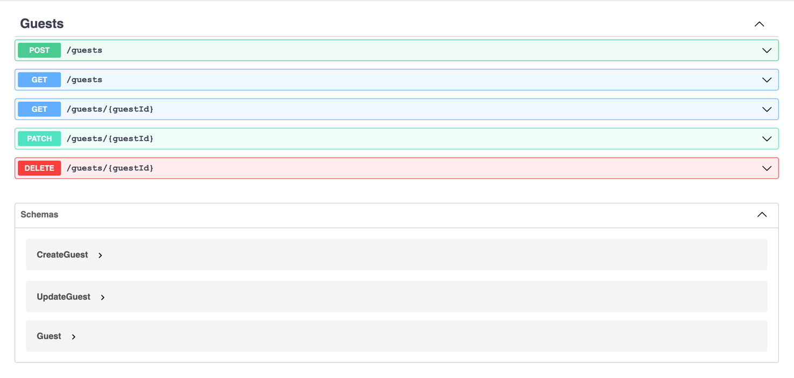

### Docker
Необходимо добавить в свой hosts файл — `127.0.0.1 api.local` 

Собрать: `docker-compose build`

Запустить: `docker-compose up -d`

### Preparation

В `.env` файле установить следующие значения
```
APP_URL=http://api.local

DB_CONNECTION=pgsql
DB_HOST=db
DB_PORT=5432
DB_DATABASE=db
DB_USERNAME=user
DB_PASSWORD=user
```

Миграции: выполнить внутри контейнера `php artisan migrate`

### Tests
Добавлено по одному happy-path тесту на каждый роут группы `guests`

Запустить: выполнить внутри контейнера `php artisan test`

### Headers
Добавлены заголовки `X-Debug-Time` и `X-Debug-Memory`, указывающие время выполнения запроса и затраченную память

### Docs
По пути `/docs` доступна документация в виде Swagger UI. http://api.local/docs


